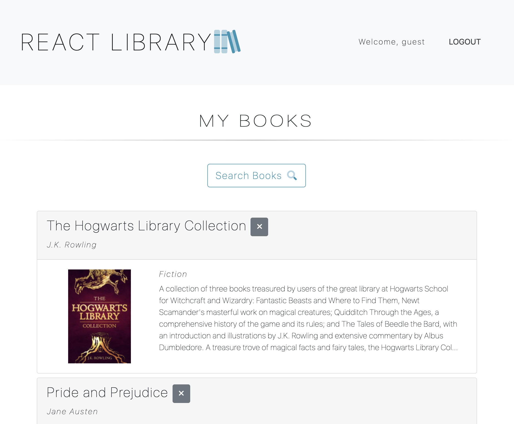
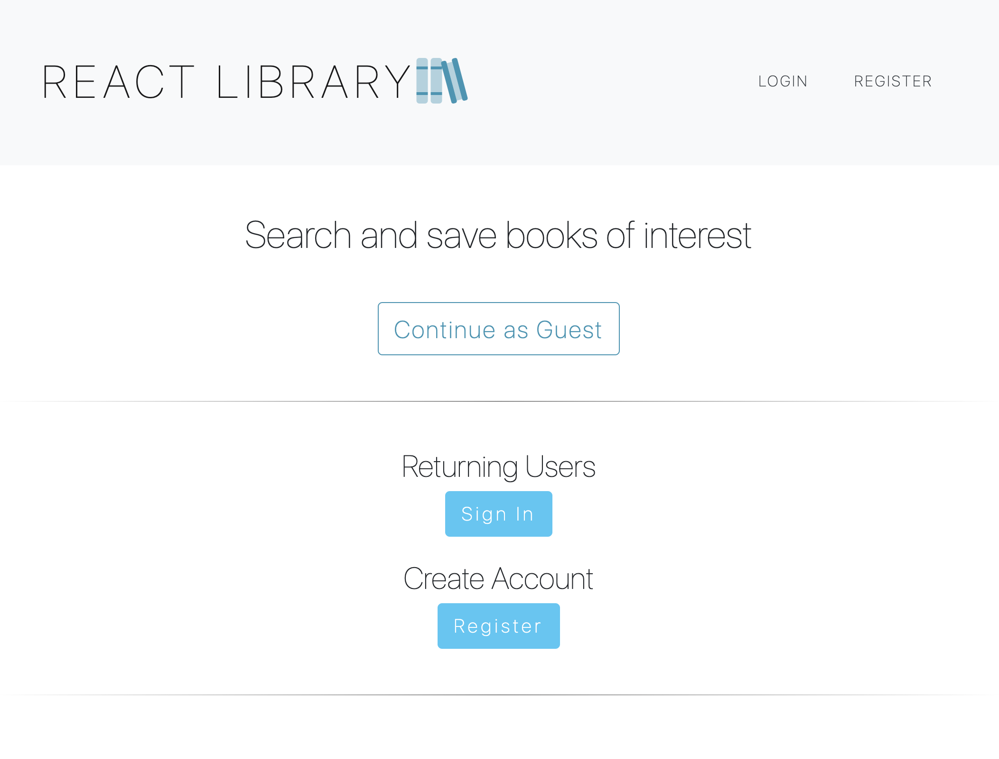

# React Library Book Search Application

## Deployed Application

[React Library Book Search Application](https://reactlibrary-mh.herokuapp.com/)

## Description 

This in-progress full-stack web application allows users to search for books, browse results, and add/remove books to/from a personal list. Users may create and log into their own account or use the guest/demo account.

When the user navigates to the homepage, they have the ability to continue as a guest (which redirects them to the guest/demo account), log into an existing account, or create a new account using a username, password, and email. Once the user is successfully logged into any account, they may browse books and add any book of choice to the account's books list. Users may also navigate to their user/detail page where saved books are displayed and where they may choose to delete any book from their personal list.

This application stores user data in MongoDB Atlas while online, and authentication is performed using Passport. Routes are protected using higher-order components which redirect users to/away certain pages whether logged in or not. When a book is already added to a user's list, the same book will not be added again (duplicates are prevented). 

## Features

* Google Books API used to retrieve search results.
* Node.js back-end with Express routing. 
* Passport authenticates and authorizes users.
* React front-end with React Router to handle pages.
* React components organize page functions and elements.
* Utilizes React Context API to manage state globally.
* MongoDB/Mongoose stores and retrieves blog posts.
* Incorporates Bootstrap for styling. 

## Credits

Michael Hanson
* michaeledwardhanson@gmail.com
* [GitHub](https://github.com/mhans003)
* [LinkedIn](https://www.linkedin.com/in/michaeledwardhanson/)

## License 

Licensed under the [MIT License](./LICENSE.txt).